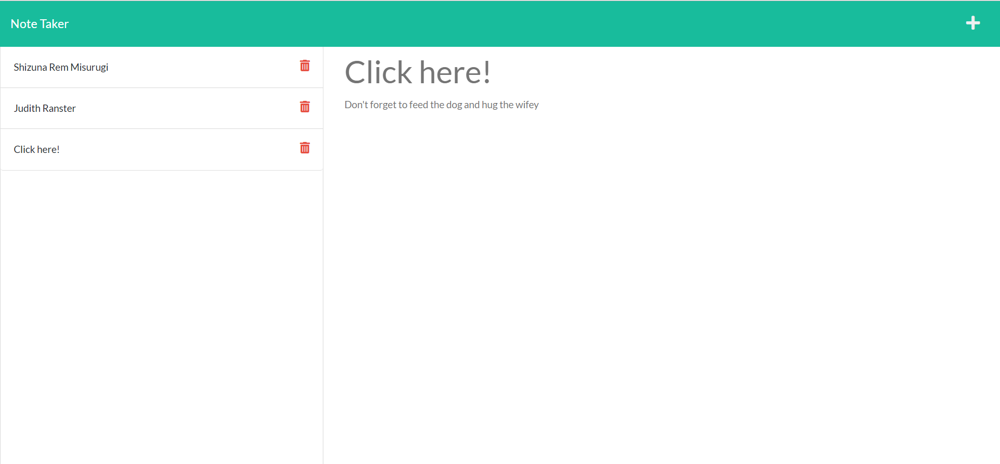

# note-taker

[](https://opensource.org/licenses/MIT)

This is a simple note taking application that allows a user to create and view notes. A user can also delete notes they no longer need. A great way to organize one's thoughts.


## Installation

 First you want to clone this repository into your system

  ```
  git clone git@github.com:EajayD/note-taker.git
  ```

  Then you want to install the npm package 

  ```
  npm i 
  ```

  Once you have the node modules you can run the command below in your terminal to initiate the program

  ```
  node server.js
  ```

  Then head over to <a href = "http://localhost:3001">http://localhost:3001</a> and get started with your note taking

## Usage

Alternatively you can click this live deployed link powered be Heroku to get started

<a href ="https://mighty-reef-11300.herokuapp.com/">https://mighty-reef-11300.herokuapp.com/</a>

Below is a preview of what to expect on your note taking adventure



## Built With

* [HTML](https://developer.mozilla.org/en-US/docs/Web/HTML)
* [CSS](https://developer.mozilla.org/en-US/docs/Web/CSS)
* [Git](https://git-scm.com/about)
* [Github](https://github.com/)
* [Javascript](https://developer.mozilla.org/en-US/docs/Web/JavaScript)
* [Bootstrap](https://getbootstrap.com/docs/5.0/getting-started/introduction/)
* [Node.js](https://nodejs.org/en/docs/)
* [Expressjs](https://www.npmjs.com/package/express)
* [Heroku](https://devcenter.heroku.com/)


## Authors

* **Eajay Delos Santos** 

    - [Link to Github](https://github.com/EajayD)
    - [Link to LinkedIn](https://www.linkedin.com/in/eajay-delos-santos-912950214/)

## License
  
 [MIT License](https://opensource.org/licenses/MIT)
  
  ---


